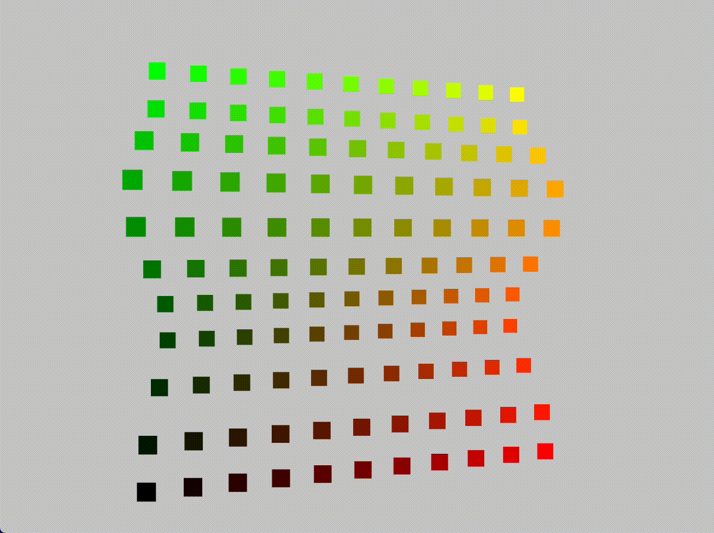

# Dynamic GPGPU Particles with Three.js & React Three Fiber Tutorial

A Peek into the Lessons:

---
## Description

Hello there! 👋 Welcome to my repository.This is where I share my journey as I navigate my way through [Yuri Artiukh's exciting tutorial](https://threejs-workshops.com/workshop/dynamic-gpgpu) on creating dynamic GPGPU particles using Three.js and React Three Fiber.

Yuri's tutorial starts from the basics, making it accessible to beginners, and goes all the way into building a full-blown GPGPU animation engine from scratch. The magic lies in harnessing the power of shaders to perform computations - this opens up possibilities that far outstrip what you can usually do on the CPU. Imagine a system with millions of particles.

**Here's what I'm learning:**

- Building an FBO (Frame Buffer Object) from scratch 🛠️
- Creating a physics engine right in the shaders 🌌
- Developing dynamic particle emitters 🎆

**And these are the websites that inspired the demos in the tutorial:**

- nightingale.world
- www.iegao.co.jp
- dala.craftedbygc.com
